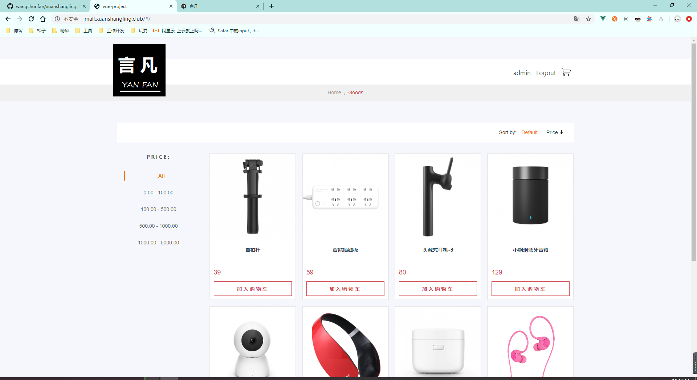
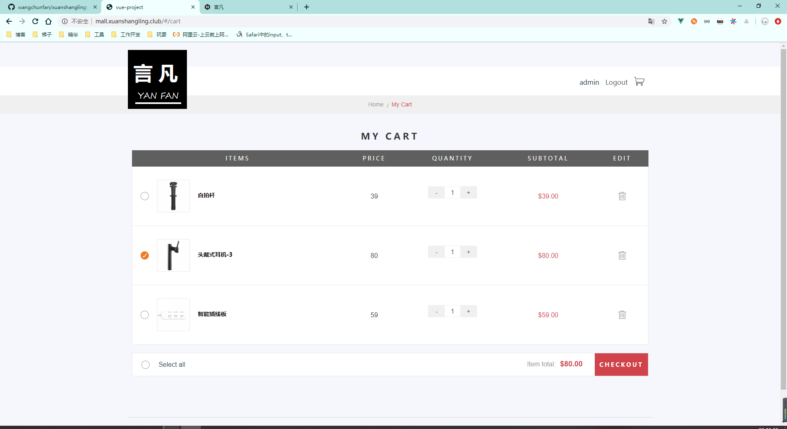
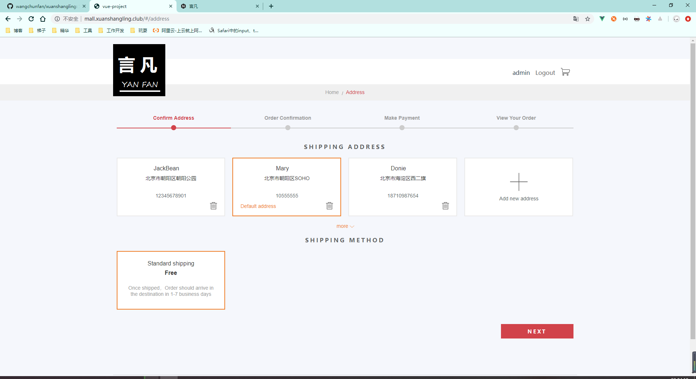
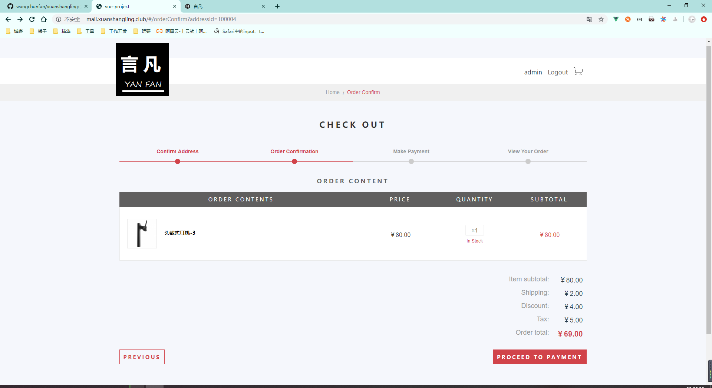
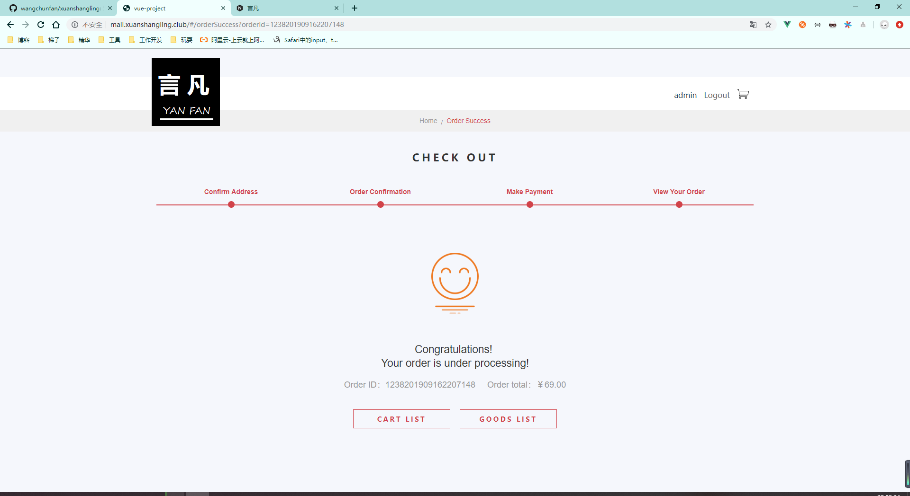

# 商城小项目

## 在线访问地址

[http://mall.xuanshangling.club/](http://mall.xuanshangling.club/)

## 主要页面

- 商品列表



- 购物车



- 选择地址



- 确认订单



- 订单列表



## 技术栈

- 前端：vue
- 后端：node
- 存储：mongodb

## 功能分支

创建若干分支，每个分支实现了一个功能模块或者是讲诉一个知识点

- `basic-vue`：vue基础知识
- `module-goodsList`：商品列表模块的前端实现
- `node`：后端 Node 服务搭建
- `mongodb`：mongodb 的使用
- `module-goods-and-mongodb`：基于 node 和 MongoDB 开发商品列表后端接口
- `module-login`：登录模块的实现
- `module-goodsCart`：购物车模块
- `module-address`：地址模块
- `module-order`：订单模块
- `dev`：开发分支
- `master`：主分支，包含所有功能

## 启动项目

### 前端

根目录下就是前端代码文件

修改 `config/index.js` 下的访问地址和端口，还有代理 target，启动前端

```js
npm install
npm run dev
```

### 后端

后端代码在 server-express 目录下

需要先创建 MongoDB 数据库，导入 MongoDB 数据，参考 mongodb 分支

修改 `server-express/routes/goods.js` 的 MongoDB 连接串，启动后端

```js
cd server-express
npm install
node bin/www
```

## 线上部署

### 前端

```json
# 打包
npm run build
```

注意：默认访问路径是 `assetsPublicPath = '/'`，即访问 `localhost:8080`。通过
`config/index.js` 下的 `assetsPublicPath = 'demo'` 可以设置访问的目录为：`localhost:8080/demo`

前端部署，可以将构建好的文件放到 NGINX 中，也可以放到部署好的 node 中（这样就要先部署后端代码了）。

部署到node中：需要修改 `server-express/app.js` 中的静态文件路径，否则不能直接访问 node 服务端的静态资源

```js
//设置静态文件路径
app.use(express.static(path.join(__dirname, 'public')));
```

如果部署到 NGINX 中，需要处理跨域问题。

### 后端

将 `server-express` 中源代码上传到服务器，部署与在开发环境中一样。

使用 pm2,一个带有负载均衡功能的 Node 应用进程管理器，将应用运行在后台。

[参考：PM2 使用入门](https://blog.csdn.net/mjzhang1993/article/details/79793071)

```js
# 安装依赖
npm i
# 安装pm2
npm install pm2 -g
# 启动项目
pm2 start bin/www
# 查看当前进程状态
pm2 list
```
